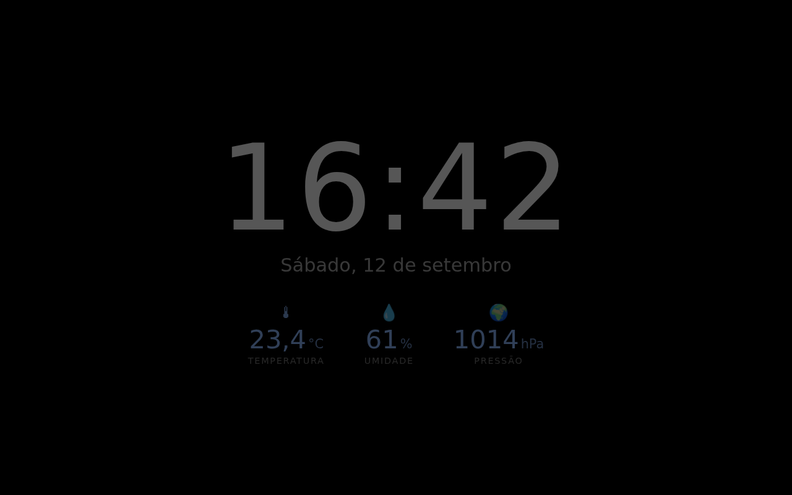

# Protetor de Tela (`custom:screensaver-card`)

Protetor de tela para painéis do Home Assistant: depois de X segundos sem
interação, cobre a interface com um fundo escuro mostrando **relógio, data,
temperatura, umidade e pressão atmosférica**. À noite o conteúdo escurece
automaticamente. Qualquer toque/clique/tecla desliga o protetor.

## Instalação

1. Copie `screensaver-card.js` para `config/www/` do HA
   (ou rode `./scripts/deploy-ha.sh`, veja o [guia de kiosk](KIOSK.md)).
2. **Configurações → Painéis → Recursos** → adicionar
   `/local/screensaver-card.js` como **Módulo JavaScript**.
3. Recarregue o navegador com cache limpo.
4. No dashboard: **Adicionar card → Protetor de Tela**.

> HACS baixa somente o arquivo declarado em `hacs.json`
> (`caixa-dagua-card.js`), então o protetor de tela é instalado manualmente
> ou pelo script de deploy.

## Modos

| Modo | O que faz |
|---|---|
| `overlay` *(default)* | Monitora a inatividade e cobre **toda** a interface do HA naquele navegador. O card no dashboard vira um painel de status com prévia e botão “Testar agora”. |
| `card` | Renderiza o relógio + sensores dentro do próprio card. Ideal para uma view com `panel: true` aberta permanentemente num tablet. |

## Opções

| Opção | Descrição | Padrão |
|---|---|---|
| `mode` | `overlay` ou `card` | `overlay` |
| `idle_seconds` | Segundos sem interação para ativar (`0` desliga a ativação automática) | `120` |
| `temperature_entity` | Sensor de temperatura | *(autodescoberta)* |
| `humidity_entity` | Sensor de umidade | *(autodescoberta)* |
| `pressure_entity` | Sensor de pressão atmosférica | *(autodescoberta)* |
| `entity_prefix` | Prefixo usado na autodescoberta | `utilidades` |
| `extra_entities` | Lista extra: `sensor.x` ou `{entity, name, icon}` | `[]` |
| `show_date` | Mostrar a data | `true` |
| `show_seconds` | Mostrar segundos | `false` |
| `clock_24h` | Relógio 24h | `true` |
| `locale` | Locale de data/hora | `pt-BR` |
| `background` | Cor de fundo | `#000000` |
| `text_color` | Cor do relógio | `#f5f5f5` |
| `accent_color` | Cor dos sensores | `#8ab4f8` |
| `night_dim` | Escurecer à noite | `true` |
| `day_brightness` | Brilho de dia (0.05–1) | `1` |
| `night_brightness` | Brilho de noite (0.05–1) | `0.35` |
| `night_start` / `night_end` | Faixa da noite (`HH:MM`) | `22:00` / `06:30` |
| `use_sun` | Usar `sun.sun` em vez dos horários | `true` |
| `dim_dashboard` | Escurecer também o dashboard à noite | `false` |
| `burn_in_protection` | Desloca o conteúdo alguns pixels a cada minuto | `true` |
| `fade_ms` | Duração do fade de entrada/saída | `800` |
| `disable_on_mobile` | Não ativar em telas < 500px | `false` |

Tudo isso também é editável pelo **editor visual** do Lovelace.

## Autodescoberta dos sensores ESPHome

Se `temperature_entity` / `humidity_entity` / `pressure_entity` ficarem vazios,
o card procura em `hass.states` um `sensor.*` que:

1. tenha o `device_class` correspondente (`temperature`, `humidity`,
   `pressure`/`atmospheric_pressure`) **e** contenha `entity_prefix` no
   `entity_id`; ou
2. contenha o prefixo **e** uma palavra conhecida no `entity_id`
   (`temperatura`, `umidade`, `pressao`, `temperature`, `humidity`, `pressure`…).

Com o dispositivo ESPHome chamado `utilidades`, entidades como
`sensor.utilidades_temperatura` são encontradas sem configurar nada.
Sensores `unavailable`/`unknown` são simplesmente omitidos.

## Exemplos YAML

Overlay (o mais comum — um card em qualquer view do painel do tablet):

```yaml
type: custom:screensaver-card
mode: overlay
idle_seconds: 120
entity_prefix: utilidades
night_dim: true
night_brightness: 0.3
use_sun: true
extra_entities:
  - entity: sensor.nivel_caixa_dagua
    name: Caixa d'água
    icon: mdi:water
```

View dedicada em painel (modo `card`), útil como “relógio de parede”:

```yaml
views:
  - title: Relógio
    path: relogio
    panel: true
    cards:
      - type: custom:screensaver-card
        mode: card
        show_seconds: true
        temperature_entity: sensor.utilidades_temperatura
        humidity_entity: sensor.utilidades_umidade
        pressure_entity: sensor.utilidades_pressao
```

## Prévia sem o Home Assistant

Abra `docs/preview.html` no navegador (funciona em `file://`): ele usa um
`hass` falso e permite alternar dia/noite e segundos para ajustar cores e
brilho antes de subir para o HA.



## Observações

- A inatividade é medida **por navegador/aba** (`pointerdown`, `pointermove`,
  `keydown`, `wheel`, `touchstart`, `scroll`). Não existe estado global no HA:
  cada tablet tem o seu próprio contador.
- O primeiro toque enquanto o protetor está visível **apenas desliga** o
  protetor — ele não “vaza” o clique para o card que está atrás.
- Enquanto a aba estiver em segundo plano o contador é reiniciado, então o
  protetor não aparece “já ligado” ao voltar para a aba.
- Só existe um overlay por navegador, mesmo que o card esteja em várias views.
